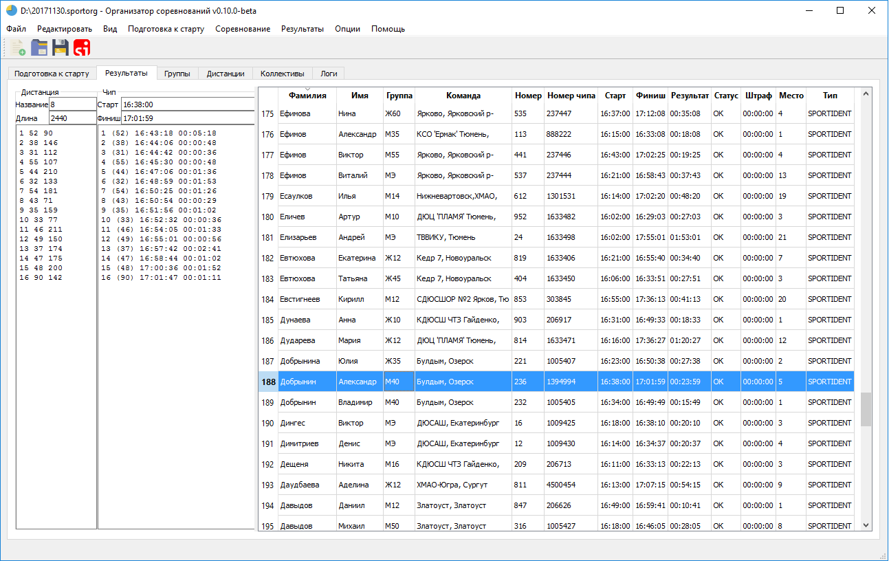

# SportOrg

### Packages

- PyQt5
- [sireader](https://pypi.python.org/pypi/sireader/1.0.1)
- jinja2
- [polib](http://polib.readthedocs.io/en/latest/quickstart.html)

Install packages
```commandline
pip install package-name

pip install sireader
```

or

```commandline
pip install -r requirements.txt
```

Run

```commandline
python SportOrg.pyw
```

### Struct

```
<sportorg>/
    data/
    docs/
    log/
    templates/
    test/
    img/
        icon/
    languages/
        <lang>/
            LC_MESSAGES/
                sportorg.po
    sportorg/
        core/
        gui/
        models/
        modules/
        libs/
        utils/
```





### build `go`

[josephspurrier](https://github.com/josephspurrier/goversioninfo) for build `.syso`

```
./goversioninfo -icon=img/icon/sportorg.ico

go build -ldflags="-H windowsgui" -o SportOrg.exe
```