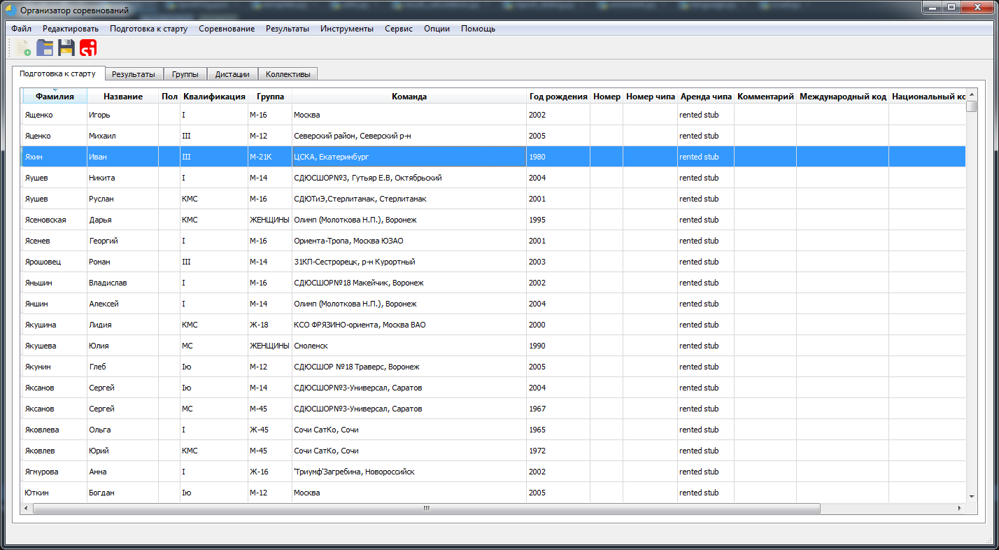
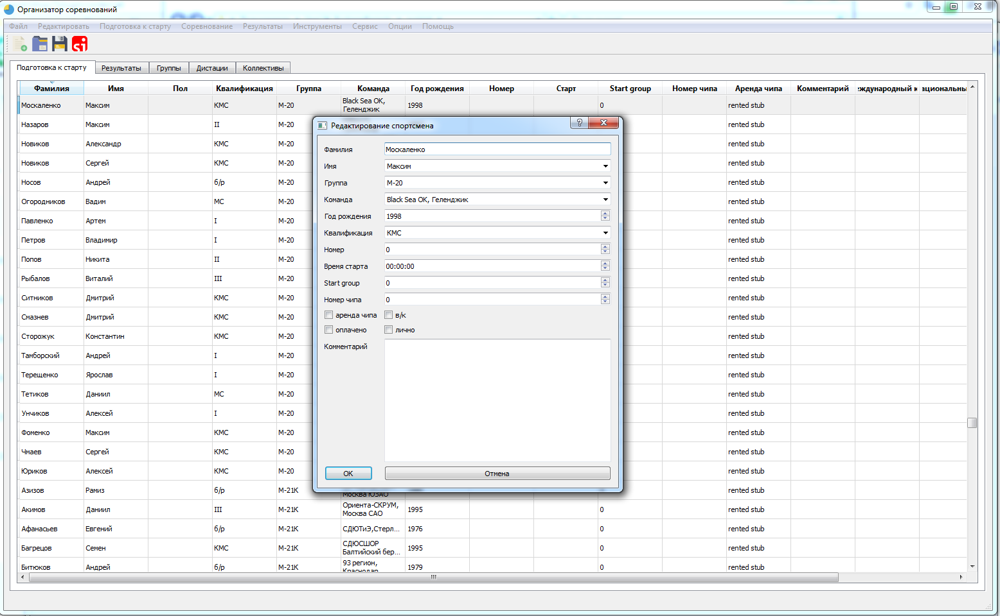

[](https://travis-ci.org/sportorg/pysport)
[](https://www.python.org/downloads/)
[](https://github.com/sportorg/pysport/blob/dev/LICENSE)
[](https://github.com/sportorg)
[](https://github.com/sportorg/pysport)
[](https://github.com/sportorg/pysport)

# SportOrg

```commandline
pip install -r requirements.txt
```

Run

```commandline
python SportOrg.pyw
```






## build

### cx_Freeze

`python setup.py build`
